# Xcode Themes

18 hand-made color schemes for Xcode, each shipped in three font variants (SF Mono, JetBrains Mono, Maple Mono) and in **both** theme formats:

| Format | Extension | Xcode |
|---|---|---|
| Classic | `.xccolortheme` (plist) | any version |
| Recipe | `.xcworkspacecolortheme` (JSON, OKLCH in Display P3) | 27+ |

That's 54 classic + 54 recipe files in [`themes/`](themes). The recipe format is colors-only (fonts are set separately in Xcode 27), so the three font variants of a palette are identical there.

## Install

```bash
git clone git@github.com:g-cqd/xcode-themes.git && cd xcode-themes && ./install.sh
```

or copy the files you want into `~/Library/Developer/Xcode/UserData/FontAndColorThemes/`, then pick the theme in **Settings › Themes**.

## Previews

Rendered straight from the theme files by [`tools/render-previews.py`](tools/render-previews.py); the swatch row shows keyword, project type, system type, project function, system function, variable, string, number, attribute, preprocessor, comment, and plain text.

## Dark

### Ayu Dark

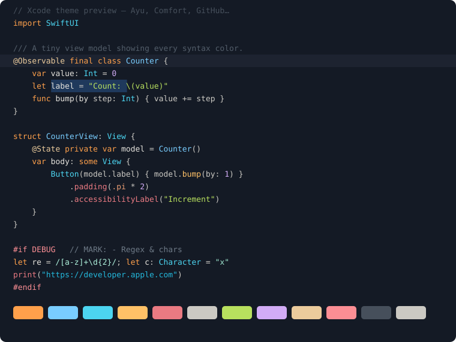

### Ayu Dark Vibrant

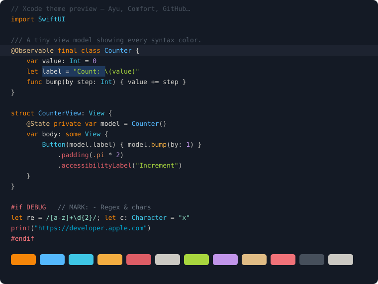

### Ayu Neutral

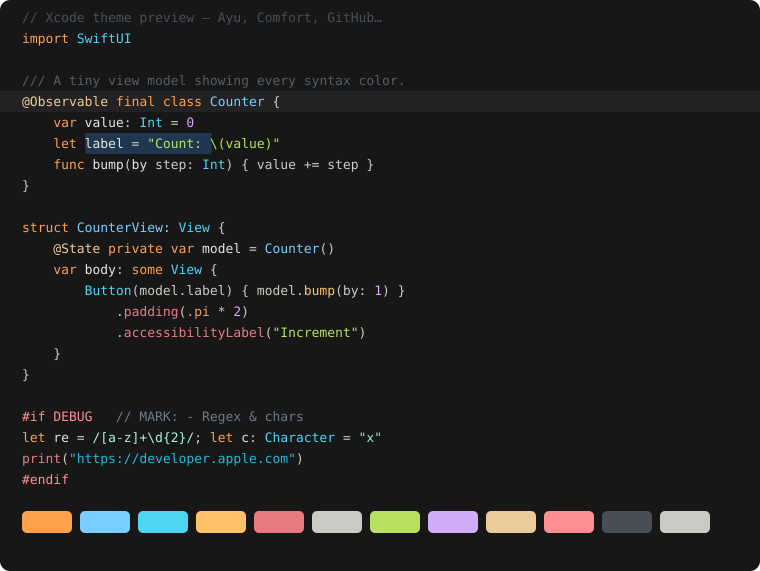

### Ayu Neutral Vibrant

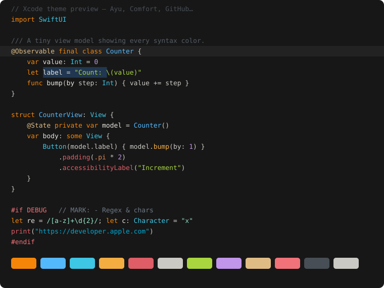

### Black & White

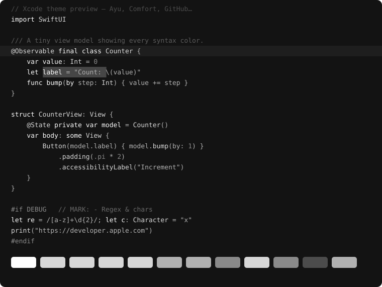

### Comfort Amber Dark

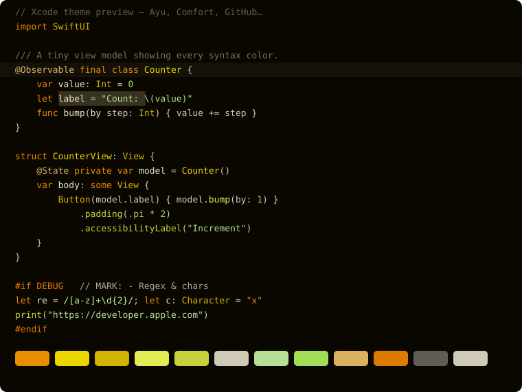

### Comfort Brown Dark

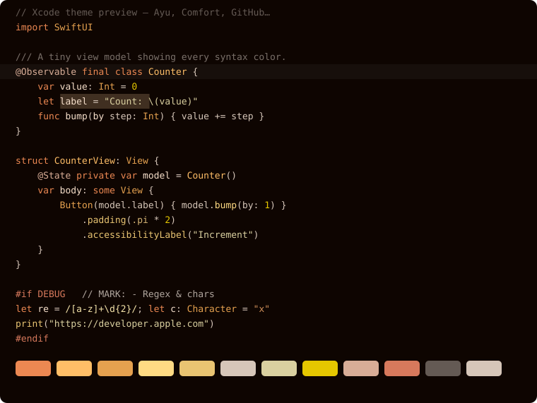

### Comfort Red Mono

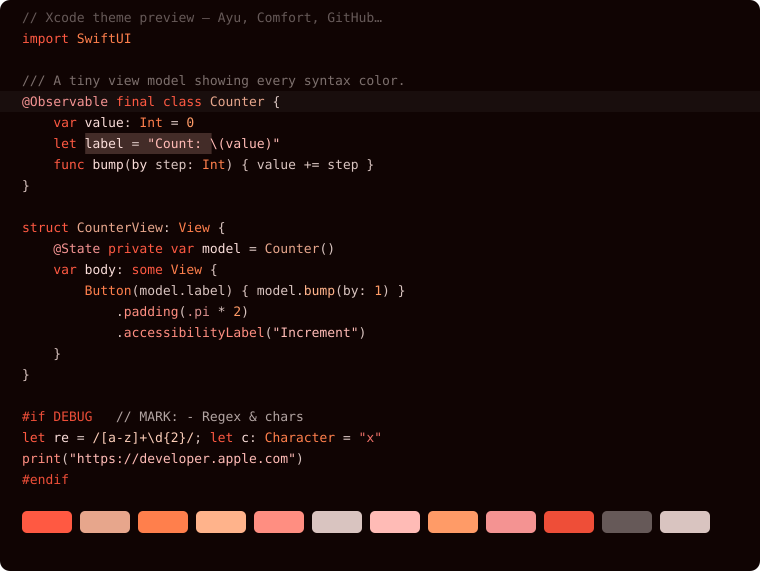

### Comfort Red Poly

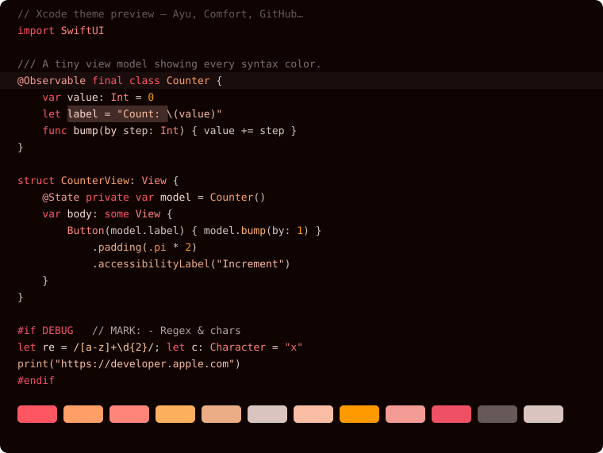

### GitHub Dark

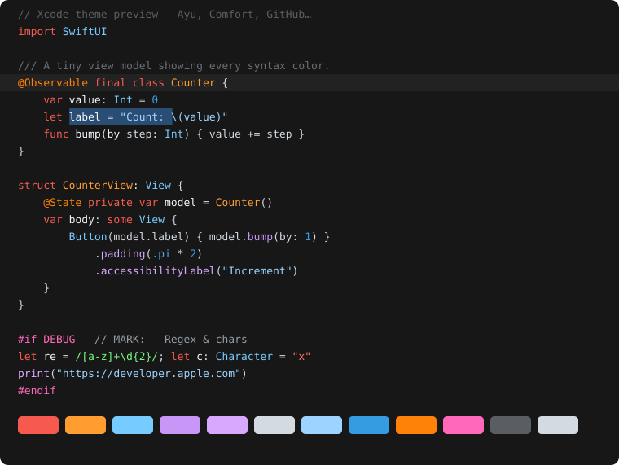

### GitHub Dark Vibrant


## Light

### Ayu Light

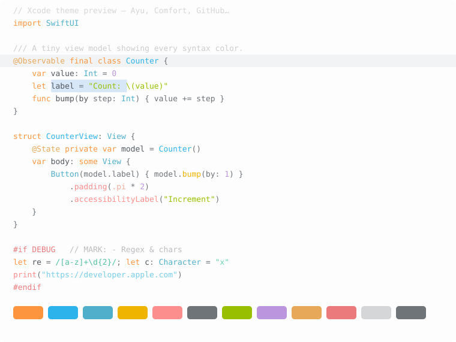

### Ayu Light Vibrant

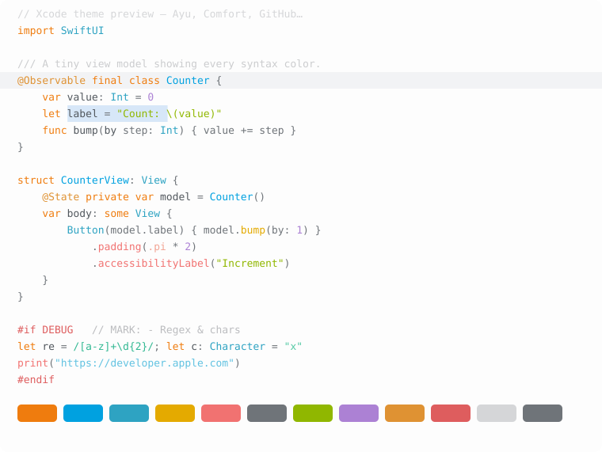

### Comfort Amber Light

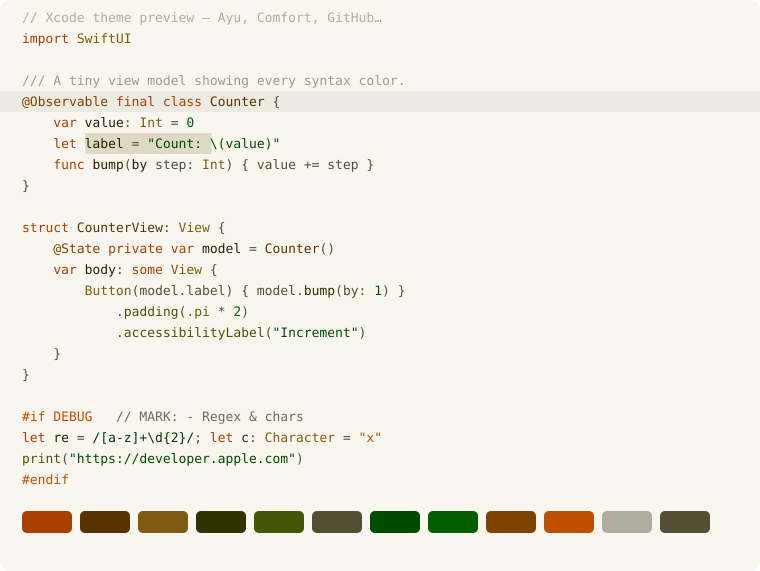

### Comfort Brown Light

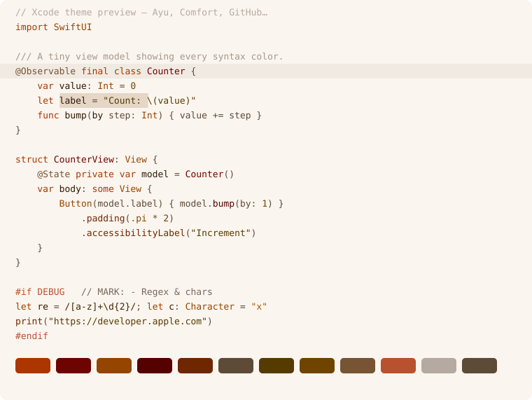

### GitHub Light

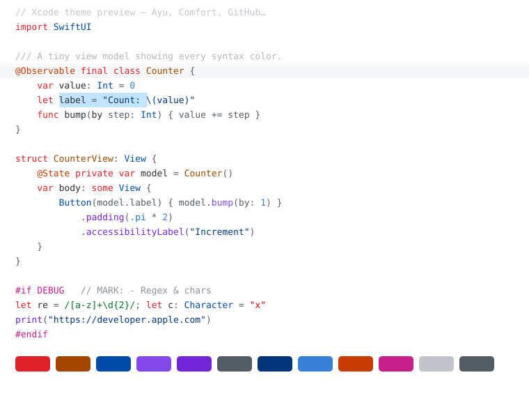

### GitHub Light Vibrant

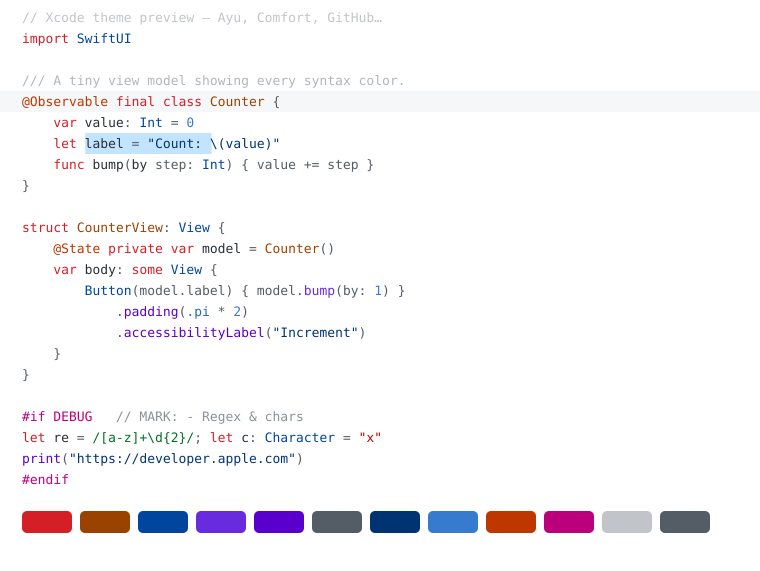

### White & Black

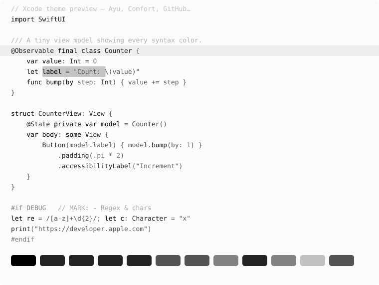

## Tools

- `tools/xccolortheme-to-workspace.swift` — converts a classic theme to the Xcode 27 recipe format, matching Xcode's own importer to four decimals (generic-RGB gamma 1.8 → Display P3 → OKLCH, alpha colors flattened onto the background in gamma-encoded P3). Build with `swiftc -O -framework AppKit -o convert tools/xccolortheme-to-workspace.swift`, then `./convert convert In.xccolortheme Out.xcworkspacecolortheme`.
- `tools/render-previews.py themes previews` — regenerates the SVG previews.

## License

MIT
